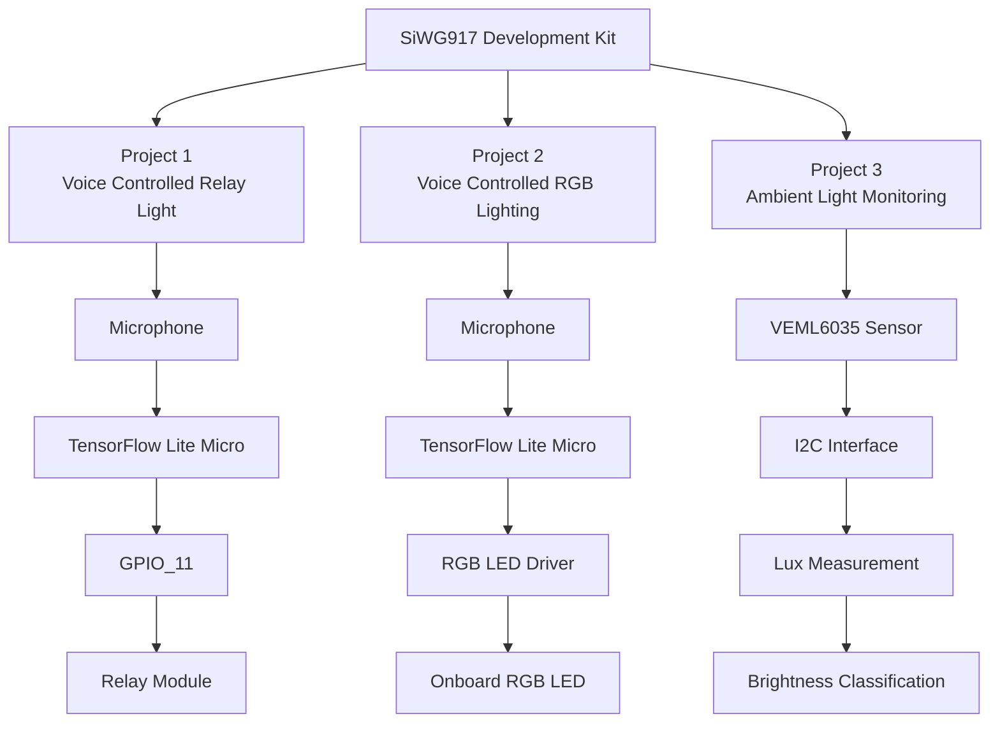

# Silicon Labs IoT Projects Collection

This repository contains a collection of IoT and Edge AI projects developed using the Silicon Labs SiWG917 Development Kit under the Centre of Innovation in IoT initiative.

The projects demonstrate the practical implementation of Embedded AI, Voice Recognition, Sensor Integration, GPIO Control, and Real-Time Embedded Systems using the Silicon Labs ecosystem.

---

## 1. Project Overview

This repository showcases three independent projects built on the Silicon Labs SiWG917 platform:

### Project 1 – Voice Controlled Relay Light

A voice-controlled home automation system that recognizes predefined voice commands and controls external appliances through a relay module connected to GPIO_11.

**Features**

* Offline Voice Recognition
* TensorFlow Lite Micro Inference
* GPIO-Based Relay Control
* Edge AI Processing
* Smart Home Automation

---

### Project 2 – Voice Controlled RGB Lighting System

A voice-controlled RGB lighting application that uses the onboard microphone and embedded machine learning model to recognize voice commands and control the onboard RGB LED.

The LED cycles through:

* Red
* Green
* Blue
* White

using successive ON commands while OFF turns the LED off.

**Features**

* Offline Voice Recognition
* RGB LED Control
* Sequential Color Cycling
* TinyML Deployment
* Embedded AI Demonstration

---

### Project 3 – Ambient Light Monitoring System

An ambient light monitoring application using the onboard VEML6035 Ambient Light Sensor.

The system continuously measures lux values and classifies ambient lighting conditions.

**Features**

* Real-Time Lux Measurement
* Ambient Light Monitoring
* I2C Sensor Interface
* Brightness Classification
* Environmental Sensing

---

## 2. Technical Architecture



---

## 3. Technologies Used

### Wireless Technologies

* Wi-Fi 6 Capable Platform (SiWG917)
* Bluetooth Low Energy Capable Platform

### SDKs and Frameworks

* Silicon Labs SDK 2025.12.1
* TensorFlow Lite for Microcontrollers

### Programming Languages

* C
* C++

### Development Tools

* Simplicity Studio 6
* Visual Studio Code
* GCC ARM Toolchain
* CMake
* Simplicity Commander
* GitHub

---

## 4. Hardware Components

### Silicon Labs Hardware

* Silicon Labs SiWG917 Development Kit (BRD2605A)
* Onboard Microphone
* Onboard RGB LED
* Onboard VEML6035 Ambient Light Sensor

### External Hardware

#### Project 1

* 5V Relay Module
* LED
* 330Ω Resistor
* Jumper Wires
* Appliance / Bulb

#### Project 2

* No External Hardware Required

#### Project 3

* No External Hardware Required

---

## Repository Structure

```text
SiliconLabs
│
├── aiml_soc_voice_control_light_siwg917_baremetal1
│   └── Voice Controlled Relay Light
│
├── aiml_soc_voice_control_light_siwg917_baremetal2
│   └── Voice Controlled RGB Lighting System
│
└── sl_si91x_veml6035
    └── Ambient Light Monitoring System
```

---

## 7. Software Components / Dependencies

### Silicon Labs Dependencies

* Silicon Labs SDK Version: 2025.12.1
* Simplicity Studio Version: 6

### Reference Examples

* aiml_soc_voice_control_light_siwg917_baremetal
* sl_si91x_veml6035

### External Software Dependencies

* TensorFlow Lite for Microcontrollers
* GCC ARM Toolchain
* CMake Build System
* Visual Studio Code
* GitHub

---

## 8. Licensing

This repository is released under the MIT License.

Permission is granted to use, modify, distribute, and sublicense this project provided that the original copyright notice and license are included in all copies or substantial portions of the software.

Refer to the LICENSE file located in the repository root directory for complete license information.

---

## 9. Maintainers / Contacts

| Name     | Role              | Contact Information                                       | Github Profile                     |
| -------- | ----------------- | --------------------------------------------------------- | ---------------------------------- |
| Vishal P | Student Developer | [ppsvishal4000@gmail.com](mailto:ppsvishal4000@gmail.com) | https://github.com/vichukuttan4000 |

---

## Project Status

| Project                              | Status    |
| ------------------------------------ | --------- |
| Voice Controlled Relay Light         | Completed |
| Voice Controlled RGB Lighting System | Completed |
| Ambient Light Monitoring System      | Completed |

---

## Repository

GitHub Repository:

https://github.com/vichukuttan4000/SiliconLabs
