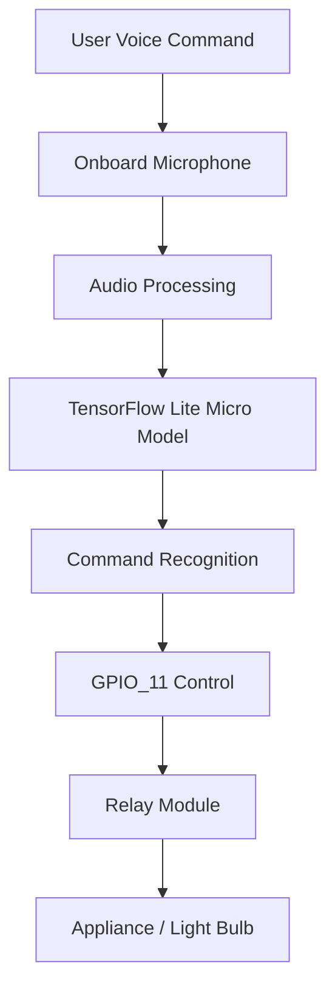

# Voice Controlled Relay Light using Silicon Labs SiWG917

## 1. Project Overview

This project implements a voice-controlled home automation system using the Silicon Labs SiWG917 Development Kit. The system utilizes the onboard microphone and a TensorFlow Lite for Microcontrollers based machine learning model to recognize predefined voice commands such as "ON" and "OFF".

Based on the detected command, the system controls external appliances through a relay module connected to GPIO_11. The project demonstrates Edge AI based voice recognition and smart appliance automation without requiring cloud connectivity, internet access, or external voice assistants.

The entire voice recognition and decision-making process runs locally on the SiWG917 device, providing low latency and enhanced privacy.

## 2. Technical Architecture



## 3. Technologies Used

### Wireless Technologies

* Wi-Fi 6 Capable Platform (SiWG917)
* Bluetooth Low Energy Capable Platform

### SDKs and Frameworks

* Silicon Labs SDK 2025.12.1
* TensorFlow Lite for Microcontrollers

### Programming Languages

* C
* C++

### Development Tools

* Simplicity Studio 6
* Visual Studio Code
* GCC ARM Toolchain
* CMake
* Simplicity Commander
* GitHub

## 4. Hardware Components

### Silicon Labs Hardware

* Silicon Labs SiWG917 Development Kit (BRD2605A)
* Onboard Microphone
* Onboard RGB LED

### External Hardware

* 5V Relay Module
* LED
* 330Ω Resistor
* Jumper Wires
* Power Supply
* Appliance / Bulb (Demonstration)

## 7. Software Components / Dependencies

### Silicon Labs Dependencies

* Silicon Labs SDK Version: 2025.12.1
* Simplicity Studio Version: 6
* Reference Example:

  * `aiml_soc_voice_control_light_siwg917_baremetal`

### External Software Dependencies

* TensorFlow Lite for Microcontrollers
* GCC ARM Toolchain
* CMake Build System
* Visual Studio Code

## 8. Licensing

This project is released under the MIT License.

Permission is granted to use, modify, distribute, and sublicense this project provided that the original copyright notice and license are included in all copies or substantial portions of the software.

Refer to the LICENSE file located in the repository root directory for complete license information.

## 9. Maintainers / Contacts

| Name | Role | Contact Information | Github Profile |
|--------|--------|--------|--------|
| Pravinkumar A K | Student Developer | [akpravinkumar07@gmail.com](mailto:akpravinkumar07@gmail.com) | https://github.com/AKPravinkumar |
| Rahul J | Student Developer | [rahuljawahar22@gmail.com](mailto:rahuljawahar22@gmail.com) | https://github.com/rahuljawahar |
| Sanjay Narayanan V | Student Developer | [sanjaymail322006@gmail.com](mailto:sanjaymail322006@gmail.com) | https://github.com/iamsanjaynarayanan |
| Syed Peer Mohammed N | Student Developer | [syedmuhamed2706@gmail.com](mailto:syedmuhamed2706@gmail.com) | https://github.com/syedmuhamed2706-web |
| Vignesh M | Student Developer | [vickeymailysamy534@gmail.com](mailto:vickeymailysamy534@gmail.com) | https://github.com/vignesh534 |
| Vishal P | Student Developer | [ppsvishal4000@gmail.com](mailto:ppsvishal4000@gmail.com) | https://github.com/vichukuttan4000 |

```
```
