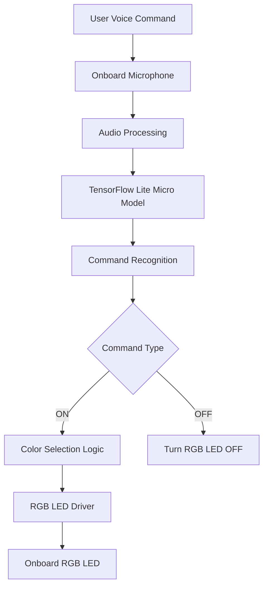

# Voice Controlled RGB Lighting System using Silicon Labs SiWG917

## 1. Project Overview

This project implements a voice-controlled RGB lighting system using the Silicon Labs SiWG917 Development Kit. The system utilizes the onboard microphone and a TensorFlow Lite for Microcontrollers based machine learning model to recognize predefined voice commands such as "ON" and "OFF".

Upon detecting a valid "ON" command, the onboard RGB LED turns on and cycles through different colors in sequence: Red, Green, Blue, and White. The "OFF" command turns off the currently active LED.

The project demonstrates the integration of Embedded Artificial Intelligence (TinyML), voice recognition, and RGB LED control on a low-power IoT platform while operating entirely offline without requiring cloud connectivity.

## 2. Technical Architecture



## 3. Technologies Used

### Wireless Technologies

* Wi-Fi 6 Capable Platform (SiWG917)
* Bluetooth Low Energy Capable Platform

### SDKs and Frameworks

* Silicon Labs SDK 2025.12.1
* TensorFlow Lite for Microcontrollers

### Programming Languages

* C
* C++

### Development Tools

* Simplicity Studio 6
* Visual Studio Code
* GCC ARM Toolchain
* CMake
* Simplicity Commander
* GitHub

## 4. Hardware Components

### Silicon Labs Hardware

* Silicon Labs SiWG917 Development Kit (BRD2605A)
* Onboard Microphone
* Onboard RGB LED

### External Hardware

No external hardware is required for this project.

The implementation uses only the peripherals available on the Silicon Labs SiWG917 Development Kit.

## 7. Software Components / Dependencies

### Silicon Labs Dependencies

* Silicon Labs SDK Version: 2025.12.1
* Simplicity Studio Version: 6
* Reference Example:

  * `aiml_soc_voice_control_light_siwg917_baremetal`

### External Software Dependencies

* TensorFlow Lite for Microcontrollers
* GCC ARM Toolchain
* CMake Build System
* Visual Studio Code

## 8. Licensing

This project is released under the MIT License.

Permission is granted to use, modify, distribute, and sublicense this project provided that the original copyright notice and license are included in all copies or substantial portions of the software.

Refer to the LICENSE file located in the repository root directory for complete license information.

## 9. Maintainers / Contacts

| Name     | Role              | Contact Information                                       | Github Profile                     |
| -------- | ----------------- | --------------------------------------------------------- | ---------------------------------- |
| Vishal P | Student Developer | [ppsvishal4000@gmail.com](mailto:ppsvishal4000@gmail.com) | https://github.com/vichukuttan4000 |

```
```
