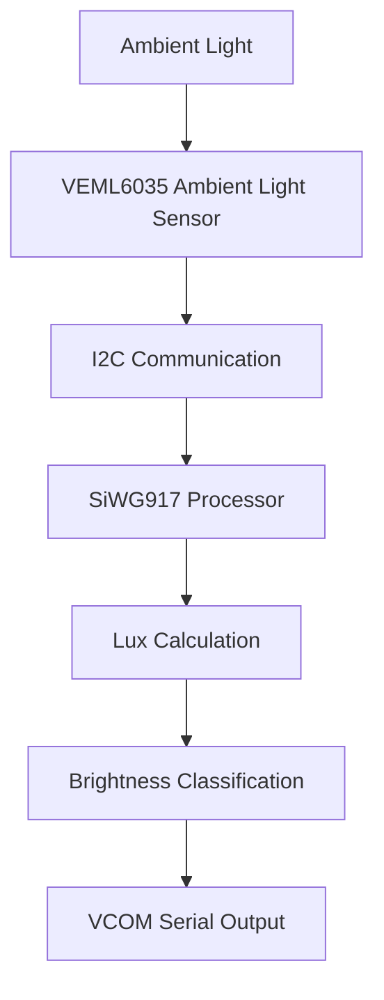

# Ambient Light Monitoring System using Silicon Labs SiWG917 and VEML6035

## 1. Project Overview

This project demonstrates ambient light monitoring using the onboard VEML6035 Ambient Light Sensor available on the Silicon Labs SiWG917 Development Kit. The system continuously measures surrounding light intensity and calculates the corresponding lux value in real time.

The measured lux value is classified into different environmental lighting conditions such as Very Dark, Dim, Normal Room Light, and Bright. The results are displayed through the VCOM serial terminal, enabling real-time monitoring and analysis of ambient lighting conditions.

The project serves as a foundation for future smart lighting systems, energy-efficient automation, and sensor-based IoT applications.

## 2. Technical Architecture



## 3. Technologies Used

### Wireless Technologies

* Wi-Fi 6 Capable Platform (SiWG917)
* Bluetooth Low Energy Capable Platform

### SDKs and Frameworks

* Silicon Labs SDK 2025.12.1

### Programming Languages

* C

### Development Tools

* Simplicity Studio 6
* Visual Studio Code
* GCC ARM Toolchain
* CMake
* Simplicity Commander
* GitHub
* PuTTY / TeraTerm

## 4. Hardware Components

### Silicon Labs Hardware

* Silicon Labs SiWG917 Development Kit (BRD2605A)
* Onboard VEML6035 Ambient Light Sensor

### External Hardware

No external hardware is required for this project.

The implementation utilizes the onboard ambient light sensor integrated into the Silicon Labs SiWG917 Development Kit.

## 7. Software Components / Dependencies

### Silicon Labs Dependencies

* Silicon Labs SDK Version: 2025.12.1
* Simplicity Studio Version: 6
* Reference Example:

  * `sl_si91x_veml6035`

### External Software Dependencies

* GCC ARM Toolchain
* CMake Build System
* Visual Studio Code
* Serial Terminal Software (PuTTY / TeraTerm)

## 8. Licensing

This project is released under the MIT License.

Permission is granted to use, modify, distribute, and sublicense this project provided that the original copyright notice and license are included in all copies or substantial portions of the software.

Refer to the LICENSE file located in the repository root directory for complete license information.

## 9. Maintainers / Contacts

| Name | Role | Contact Information | Github Profile |
|--------|--------|--------|--------|
| Pravinkumar A K | Student Developer | [akpravinkumar07@gmail.com](mailto:akpravinkumar07@gmail.com) | https://github.com/AKPravinkumar |
| Rahul J | Student Developer | [rahuljawahar22@gmail.com](mailto:rahuljawahar22@gmail.com) | https://github.com/rahuljawahar |
| Sanjay Narayanan V | Student Developer | [sanjaymail322006@gmail.com](mailto:sanjaymail322006@gmail.com) | https://github.com/iamsanjaynarayanan |
| Syed Peer Mohammed N | Student Developer | [syedmuhamed2706@gmail.com](mailto:syedmuhamed2706@gmail.com) | https://github.com/syedmuhamed2706-web |
| Vignesh M | Student Developer | [vickeymailysamy534@gmail.com](mailto:vickeymailysamy534@gmail.com) | https://github.com/vignesh534 |
| Vishal P | Student Developer | [ppsvishal4000@gmail.com](mailto:ppsvishal4000@gmail.com) | https://github.com/vichukuttan4000 |

```
```
